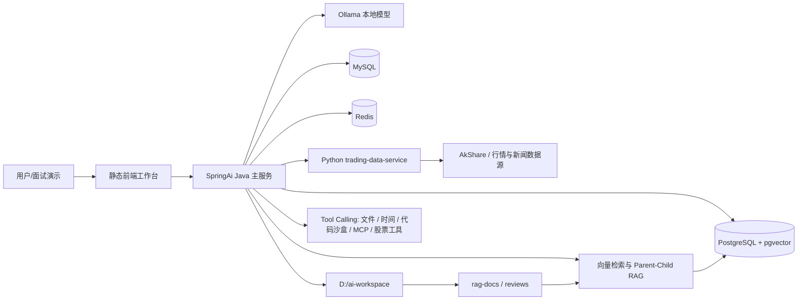

# SpringAi Trading Agent

一个基于 Spring AI 的本地多 Agent 交易研究系统。项目核心目标不是做“荐股工具”，而是把大模型 Agent、工具调用、RAG、结构化输出、交易数据服务和前端工作台串成一个可演示、可复盘、可继续扩展的学习型项目。

> 免责声明：本项目仅用于技术学习和工程实践展示，不构成任何投资建议。

## 项目亮点

- **多 Agent 交易研究流水线**：技术面、基本面、新闻面分别分析，再进入看多/看空辩论、风控评估、最终决策和复盘审计。
- **真实行情数据接入**：Java 后端通过独立 Python FastAPI 服务获取 A 股行情、均线、量价信号、新闻、回测指标等事实数据。
- **RAG 知识库**：从本地研报和复盘文档构建知识库，向量写入 PostgreSQL + pgvector，并支持 Parent-Child 检索和 Rerank。
- **工具调用 Agent**：支持时间查询、文件读写、代码沙盒、动态数学工具、MCP 文件系统工具、天气服务、股票数据工具等多种 Tool Calling 场景。
- **ReAct 自主取数**：模型可以根据分析任务自行选择并组合行情、均线、量价信号和新闻工具，不需要后端预先写死调用顺序。
- **结构化交易复盘**：`我的体系分析` 和 `复盘相似分析` 支持 JSON 结构化输出，后端会对关键事实进行校验，避免模型把“历史案例”误当成“当前事实”。
- **决策闭环**：完整流水线会把决策保存到数据库，后续可以按 N 天后价格变化自动结算为 HIT / MISS / FLAT。
- **定时自动化**：支持工作日自动结算历史决策、收盘后自动选股，并可通过 Server 酱推送命中结果。
- **原生前端工作台**：无前端框架，使用 `index.html + app.js` 实现聊天、RAG、交易分析、复盘保存、结构化展示和决策结算。

## 技术栈

### Java 主服务

- Java 17
- Spring Boot 3.5.14
- Spring AI 1.1.6
- Ollama：`qwen2.5:7b` 用于聊天分析，`bge-m3` 用于 embedding
- MySQL：对话记忆、交易决策记录
- PostgreSQL + pgvector：RAG 向量存储，使用余弦距离和 HNSW 索引
- Redis：通过 Spring Cache 缓存行情、新闻、策略信号和技术事实，默认 TTL 为 5 分钟
- MyBatis-Plus：决策表 CRUD
- Spring Cloud OpenFeign / Resilience4j / Nacos：微服务调用与实验
- Spring AI PgVectorStore：向量写入 PostgreSQL 的 `vector_store` 表
- MCP Client：接入本地文件系统 MCP 工具

### Python 数据服务

独立仓库：

```text
https://github.com/dty1030/trading-data-service.git
```

主要技术：

- FastAPI
- Uvicorn
- AkShare
- Pandas

Python 服务负责把行情数据、技术指标、量价信号等“确定性计算”先算好，再交给 Java 侧 Agent 使用。

## 整体架构



## 主要功能

### 1. 通用聊天 Agent

入口：

```http
POST /api/chat/stream
```

支持 SSE 流式输出，并通过 `toolMode` 切换不同能力：

| toolMode | 能力 |
| --- | --- |
| `none` | 普通聊天 |
| `time` | 当前时间工具 |
| `file` | 本地文件读写工具 |
| `rag` | RAG 知识库问答 |
| `code` | Java 代码沙盒 |
| `dyn` | 动态数学工具 |
| `mcp` | MCP 文件系统工具 |
| `review` | 保存股票复盘到知识库 |

工具权限按角色控制：

| 角色 | 允许能力 |
| --- | --- |
| `guest` | `none` / `time` / `rag` |
| `trusted` | `none` / `time` / `rag` / `file` |
| `admin` | 全部工具模式 |

### 2. 交易研究工作台

前端入口：

```text
http://localhost:8989
```

主要接口：

| 接口 | 说明 |
| --- | --- |
| `GET /api/trading/technical-real` | 基于 Python 真实指标数据做技术面分析 |
| `GET /api/trading/fundamental-parent` | Parent-Child RAG 基本面分析 |
| `GET /api/trading/fundamental-rerank` | RAG 候选文档二次打分后再分析 |
| `GET /api/trading/full` | 技术面 + 基本面 + 新闻面 + 多空辩论 + 风控 + 决策 + 复盘 |
| `GET /api/trading/debate` | 多轮看多/看空辩论 |
| `GET /api/trading/my-view-json` | 按个人交易体系输出结构化分析 |
| `GET /api/trading/review-view-json` | 当前行情与历史复盘案例做相似性分析 |
| `GET /api/trading/react` | ReAct Agent 自主选择股票数据工具并完成综合分析 |
| `GET /api/trading/decision-settle` | 结算 N 天前仍为 PENDING 的交易决策 |

`/api/trading/react` 当前可调用四类股票工具：近期新闻、均线技术事实、量价策略信号和近期行情指标。模型会根据问题决定调用哪些工具以及调用顺序。

### 3. 复盘保存与 RAG 刷新

复盘可以通过前端表单保存，也可以由聊天 Agent 在 `toolMode=review` 时调用工具保存。

| 接口/工具 | 说明 |
| --- | --- |
| `POST /api/review/save` | 保存股票复盘 Markdown 到 `D:\ai-workspace\reviews`，并自动刷新 RAG |
| `ReviewTool.saveReview` | 让 Agent 在对话中保存复盘结论，并返回保存路径 |
| `reviewOrganizerAgent` | 对用户提供的走势数据和复盘结论做 Markdown 小结 |

保存后的复盘会进入历史案例库，后续可被 `复盘相似分析` 检索到。

### 4. 定时任务与通知

| 任务 | 触发时间 | 说明 |
| --- | --- | --- |
| `DecisionEvalScheduler` | 工作日 18:00 | 自动结算 5 天前仍为 PENDING 的决策 |
| `ScreenSchedular` | 工作日 20:30 | 调用 Python `/screen` 做收盘选股 |
| `ServerChanNotifier` | 选股命中时 | 使用 `SERVERCHAN_KEY` 推送通知 |

### 5. Python 数据服务能力

Python 服务默认运行在：

```text
http://localhost:8000
```

主要接口：

| 接口 | 说明 |
| --- | --- |
| `GET /indicators` | 近期 K 线、涨跌幅、量比、均线、是否站上均线 |
| `GET /strategy` | 倍量柱、温和放量、缩量、连续阴线等策略信号 |
| `GET /market-snapshot` | 实时行情快照 |
| `GET /technical-facts` | MA5/10/20/30/60/120/240 与价格关系 |
| `GET /news` | 东财/新浪等新闻聚合 |
| `GET /backtest` | 简单均线策略回测指标 |
| `GET /screen` | 自选股条件筛选 |

注意：`/strategy` 和 `/screen` 当前会通过 `getStockData.py` 使用 `baostock`。如果只按当前 `requirements.txt` 安装后报 `No module named baostock`，需要额外安装：

```powershell
pip install baostock
```

## 目录结构

```text
SpringAi
├─ src/main/java/com/maorou/SpringAIDemo
│  ├─ auth              # 登录、JWT、工具权限控制
│  ├─ config            # ChatClient、负载均衡、注册等配置
│  ├─ controller        # 聊天、RAG、交易、代码沙盒等接口
│  ├─ entity / mapper   # 决策记录实体与 MyBatis-Plus Mapper
│  ├─ feign             # 远程服务调用示例
│  ├─ functions         # Spring AI Tools
│  ├─ prompt            # 复杂 Prompt 构建器
│  ├─ service           # RAG、交易体系分析、复盘相似、决策结算
│  ├─ utils             # 结构化报告 DTO
│  └─ workspace         # 本地/服务器工作区路径策略
├─ src/main/resources
│  ├─ application.yaml
│  ├─ application-ai-local.yaml
│  └─ static            # 原生前端 index.html + app.js
└─ README.md
```

配套 Python 仓库：

```text
trading-data-service
├─ main.py              # FastAPI 入口
├─ indicators.py        # K 线、涨跌幅、量比、均线
├─ strategy.py          # 放量、倍量柱、连续阴线等策略信号
├─ technical_facts.py   # 多周期均线事实
├─ market_snapshot.py   # 实时行情快照
├─ backtest.py          # 简单均线回测
└─ requirements.txt
```

## 本地启动

### 1. 准备 Ollama 模型

```bash
ollama pull qwen2.5:7b
ollama pull bge-m3
```

确认 Ollama 服务在：

```text
http://localhost:11434
```

### 2. 启动 Python 数据服务

```powershell
cd D:\trading-data-service
python -m venv .venv
.\.venv\Scripts\activate
pip install -r requirements.txt
python -m uvicorn main:app --reload --port 8000
```

验证：

```powershell
curl "http://localhost:8000/technical-facts?symbol=sh600519"
```

### 3. 准备 MySQL

创建数据库：

```sql
CREATE DATABASE springai
  DEFAULT CHARACTER SET utf8mb4
  COLLATE utf8mb4_unicode_ci;
```

如果要使用交易决策保存和结算功能，需要建 `decision` 表：

```sql
CREATE TABLE decision (
  id BIGINT PRIMARY KEY AUTO_INCREMENT,
  code VARCHAR(32),
  name VARCHAR(64),
  source VARCHAR(32),
  direction VARCHAR(16),
  status VARCHAR(16),
  confidence INT,
  reason TEXT,
  decided_at DATETIME,
  decided_price DECIMAL(18, 4),
  created_at DATETIME DEFAULT CURRENT_TIMESTAMP,
  outcome_price DECIMAL(18, 4),
  return_pct DECIMAL(18, 4),
  evaluated_at DATETIME
);
```

`application.yaml` 里的数据库账号密码是本地开发配置，上传或部署时请改成自己的本地配置，不要提交真实生产密码。

### 4. 准备 PostgreSQL 与 pgvector

RAG 向量目前存储在 PostgreSQL 中，默认连接配置为：

```text
jdbc:postgresql://localhost:15432/postgres
username: postgres
password: postgres
```

如果本机已经安装 Docker，可以启动一个带 pgvector 扩展的 PostgreSQL：

```powershell
docker run --name springai-pgvector `
  -e POSTGRES_PASSWORD=postgres `
  -p 15432:5432 `
  -d pgvector/pgvector:pg16
```

确认数据库已启用 vector 扩展：

```sql
CREATE EXTENSION IF NOT EXISTS vector;
```

`DataSourceConfig` 会创建 `PgVectorStore`，向量维度为 1024，距离算法为余弦距离，索引类型为 HNSW，并在启动时初始化所需表结构。

### 5. 准备 Redis

`ai-local` profile 默认连接 `localhost:6379`。如果使用 Docker：

```powershell
docker run --name springai-redis -p 6379:6379 -d redis:7-alpine
```

Redis 用于缓存 Python 数据服务返回的新闻、指标、量价信号和技术事实，默认缓存时间为 5 分钟。

### 6. 准备工作区目录

默认本地工作区：

```text
D:\ai-workspace
```

建议目录：

```text
D:\ai-workspace
├─ rag-docs             # 研报、知识库 txt 文档
├─ reviews              # 股票复盘 markdown
├─ code-sandbox         # Java 代码沙盒运行目录
└─ my-strategy.txt      # 个人交易原则
```

其中 `my-strategy.txt` 会被 `我的体系分析` 使用。原始文档仍保存在本地工作区，切块后的向量和元数据存储在 pgvector，不再写入本地 `rag-store` 文件。

### 7. 启动 Java 主服务

```powershell
cd D:\SpringAi
$env:JAVA_HOME="C:\Program Files\Java\jdk-17"
.\mvnw.cmd spring-boot:run
```

默认端口：

```text
http://localhost:8989
```

打开前端：

```text
http://localhost:8989
```

默认 profile 是 `ai-local`：

- 关闭 Nacos Discovery / Nacos Config。
- 关闭 OpenFeign CircuitBreaker。
- 使用本地工作区 `D:\ai-workspace`。
- Python 数据服务地址为 `http://localhost:8000`。
- PostgreSQL/pgvector 默认 `localhost:15432/postgres`。
- Redis 默认 `localhost:6379`，缓存 TTL 为 5 分钟。
- MCP 文件系统工具通过 `npx @modelcontextprotocol/server-filesystem` 接入本地工作区。

如果切到 `dev` profile，会启用：

- Nacos Config
- Nacos Discovery
- OpenFeign CircuitBreaker
- Resilience4j 熔断/超时配置
- Eureka 客户端实验配置

因此面试或演示本地单体能力时，建议先使用默认 `ai-local`；讲微服务实验时再说明 `dev` profile。

### 8. 加载 RAG 文档

把研报或知识文档放到：

```text
D:\ai-workspace\rag-docs
```

把历史复盘放到：

```text
D:\ai-workspace\reviews
```

然后调用：

```powershell
curl -X POST "http://localhost:8989/api/rag/reload"
```

查看状态：

```powershell
curl "http://localhost:8989/api/rag/status"
```

每次执行 reload 都会清空 `vector_store` 表，再根据 `rag-docs` 和 `reviews` 中的当前文件重新切块、生成 embedding 并写入 pgvector。

## 面试时可以重点讲的设计点

### 1. 为什么把 Python 拆成独立服务

行情抓取、Pandas 计算、AkShare 数据源更适合 Python；Agent 编排、权限控制、RAG、结构化输出和工程化接口更适合 Java/Spring。拆开后，Java 侧只拿“已经算好的事实”，避免让大模型自己乱算均线和量比。

### 2. 为什么强调结构化事实

项目里把“事实计算”和“语言分析”分开：

- Python 负责计算 `above_ma20`、`volume_ratio`、`连续阴线天数` 等事实。
- Java 后端把这些事实塞进 Prompt，并要求模型直接采信。
- 对关键 JSON 输出再做后端校验和修正，降低幻觉风险。

这比单纯让模型读一段行情文本更稳定。

### 3. RAG 不是只做简单检索

本项目的 RAG 流程包含：

- Parent-Child 检索：小块用于召回，父块用于喂给模型，减少上下文碎片化。
- pgvector 持久化：使用 PostgreSQL 保存向量和元数据，替代原来的本地 JSON 向量文件。
- Rerank：先向量召回，再由模型对候选文档做相关性打分，最后选择更相关的资料回答。

### 4. ReAct 如何决定调用什么工具

传统流水线由后端固定“先取什么数据、再调用哪个 Agent”。ReAct 接口只把问题和股票工具交给模型，模型根据当前任务自主选择新闻、均线、量价信号或近期行情，并可以连续调用多个工具后再总结。这部分用于验证 Agent 的规划和多步工具调用能力。

### 5. 交易决策不是一次性输出

完整流水线会保存决策，之后用真实价格变化结算 HIT / MISS / FLAT。这个设计让 Agent 的输出可以被后验评估，而不是停留在“生成一段看起来合理的话”。

### 6. 工具权限控制

聊天接口不是无条件开放所有工具，而是根据用户角色和 `toolMode` 判断是否允许调用。普通用户只能用安全能力，管理员才能使用更高风险工具。

## 当前限制

- 这是学习型项目，不是生产级交易系统。
- 股票数据依赖 AkShare 和外部数据源，网络和数据源变动会影响结果。
- 本地模型能力受硬件影响，复杂 Prompt 在小模型上可能超时或输出不稳定。
- 完整运行依赖 Ollama、MySQL、PostgreSQL/pgvector、Redis 和 Python 数据服务，当前尚未提供统一的 Docker Compose 编排。
- 当前前端是原生 HTML/JS，适合快速演示，不是完整工程化前端项目。
- 默认配置偏本地开发，部署前需要处理密码、JWT secret、数据库迁移、异常兜底和日志脱敏。

## 推荐演示路径

1. 打开前端首页，展示普通聊天和工具模式。
2. 切到 RAG，加载本地文档后提问。
3. 进入交易工作台，输入 `sh600519 / 贵州茅台`。
4. 依次演示：
   - 技术实盘
   - Parent 基本面
   - Rerank 基本面
   - 我的体系
   - 复盘相似
   - ReAct 自主取数分析
   - 完整流水线
5. 最后展示数据库里的决策记录，以及 `结算待评估` 的闭环。


